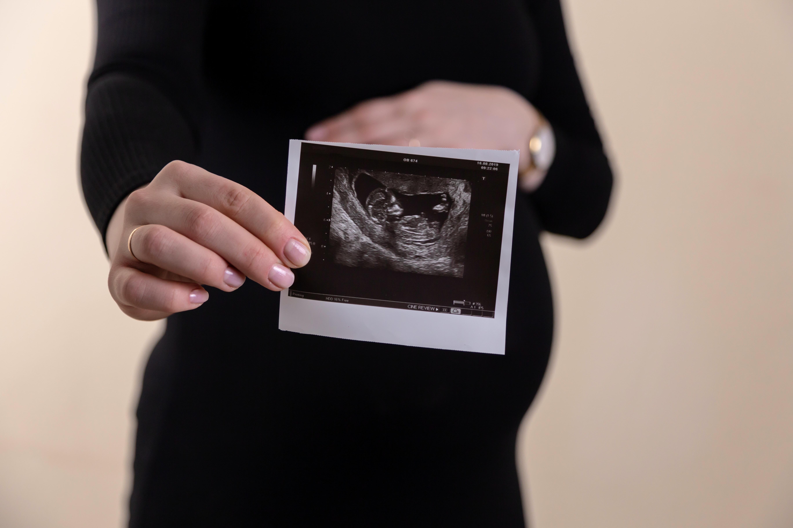

# ClassificationAutoML_Fetal_Health

  

Our objective is to completely analyze the database, understand the variables and create a Classification model that indicates the fetus' health level.

We will be exploring the field of Data Science and Machine Learning applied to the Health Insurance sector.

Fetal health is a primary concern in obstetrics and perinatal medicine, as the well-being of the fetus plays a pivotal role in healthy development and the success of childbirth. Recent data demonstrates that comprehending and monitoring fetal health is essential to ensure that babies are born without complications and remain healthy throughout their lives. The current classification project aims to address this critical issue by employing data science and machine learning techniques.

The dataset under examination focuses on the classification of fetal health, based on various variables related to the fetus's well-being. The target variable, named "Fetal Health" is a classification that encompasses three distinct categories: "Normal", "Suspect", and "Pathological".

These categories are assigned based on a variety of clinical information, such as;

* Fetal heart rate
* Fetal movements
* Uterine contractions
and other relevant parameters.

The application of advanced data science methods, such as PyCaret, enables us to analyze this complex dataset and identify patterns that can be crucial for early prediction and intervention in cases of compromised fetal health. Through the use of machine learning algorithms, we can create classification models that will assist healthcare professionals in identifying cases of risk with greater accuracy, thus improving the health of newborns and the peace of mind of families.

Throughout this work, we will explore data preprocessing techniques, model building, and performance evaluation.

We hope that the results obtained can significantly contribute to enhancing the monitoring and diagnosis of fetal health, providing more effective and secure medical care during pregnancy and childbirth. After all, every baby deserves to start their journey in life with the best possible chances for a healthy and prosperous future.
